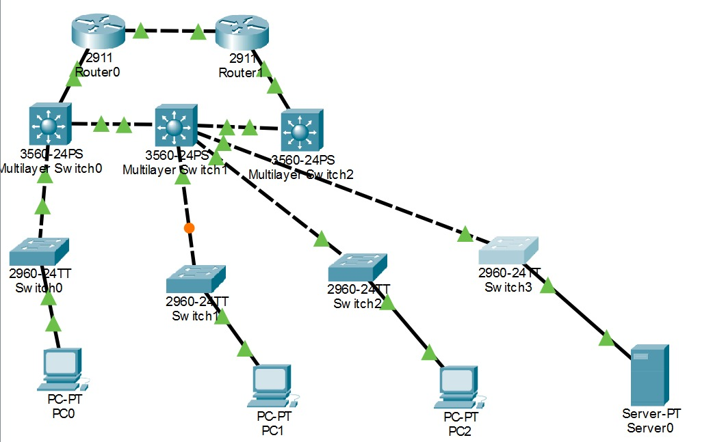
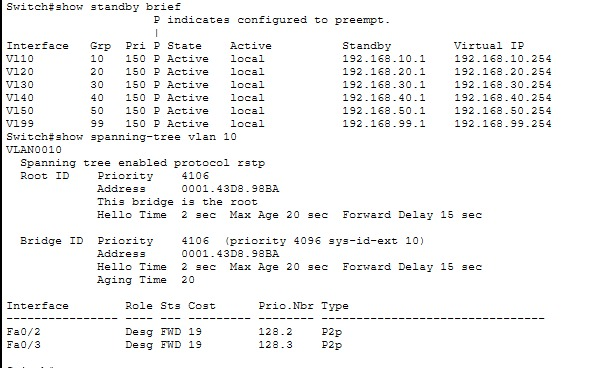
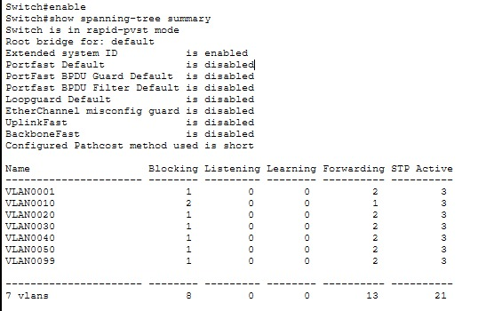

# Enterprise Network Infrastructure

A multi-VLAN enterprise campus network built and verified in Cisco Packet Tracer, demonstrating VLAN segmentation, inter-VLAN routing, HSRP gateway redundancy, Rapid PVST+, ACL-based traffic restrictions, DHCP, NAT/PAT, and internal DNS.

## Topology

- **2 × Cisco 2911 routers** — routed connectivity and NAT/PAT at the network edge
- **3 × Cisco 3560 multilayer switches** — Layer 3 routing, SVIs, HSRP, and spanning tree
- **4 × Cisco 2960 access switches** — endpoint connectivity and VLAN access
- **3 PCs and 1 DNS server** — endpoint and service testing

## VLAN Design

| VLAN | Name | Subnet |
|---:|---|---|
| 10 | IT | 192.168.10.0/24 |
| 20 | Finance | 192.168.20.0/24 |
| 30 | HR | 192.168.30.0/24 |
| 40 | Sales | 192.168.40.0/24 |
| 50 | Servers | 192.168.50.0/24 |
| 99 | Guest_WiFi | 192.168.99.0/24 |

Inter-VLAN routing is provided through SVIs on the multilayer switches.

## Implemented Features

### Layer 2 and Layer 3

- 802.1Q VLAN trunking and department-based VLAN segmentation
- Inter-VLAN routing using SVIs
- Static routing between internal networks and routed links
- Rapid PVST+ for loop prevention
- Multilayer Switch0 configured as the STP root for VLANs 10, 20, 30, 40, 50, and 99 with priority 4096
- HSRP configured for all six VLANs with virtual gateway addresses ending in .254
- Multilayer Switch0 verified as HSRP Active for all six VLANs with priority 110 and preempt enabled

### DHCP

DHCP pools provide automatic addressing for all six VLANs, including:

- Network and subnet assignment
- HSRP virtual gateway as the default router
- DNS server address 8.8.8.8 for DHCP clients
- Address exclusions for infrastructure addresses

### Access Control

Two extended ACLs enforce traffic restrictions:

- **GUEST_RESTRICT** — blocks Guest_WiFi (VLAN 99) from IT, Finance, HR, and Servers
- **SALES_RESTRICT** — blocks Sales (VLAN 40) from the Servers VLAN (50)
- ACL match counters were checked during verification

### NAT / PAT

Dynamic NAT overload (PAT) is configured on the edge router. Inside addresses are translated to the router's outside interface address.

Example verification:

- Inside local: 192.168.10.21
- Inside global: 10.0.0.1

### Internal DNS

An internal DNS server at 192.168.10.100 was configured with the record web.lab.local. Client-side nslookup and ping-by-name tests were used to verify name resolution.

## Verification

The network was tested using Cisco Packet Tracer CLI and endpoint connectivity checks, including:

- HSRP state and virtual gateway verification
- Rapid PVST+ root verification
- Inter-VLAN connectivity testing
- DHCP address assignment
- ACL filtering and match counters
- NAT/PAT translation table
- DNS name resolution using nslookup
- Ping testing with successful end-to-end connectivity

## Repository Contents

- `Enterprise Network.pkt` — main Cisco Packet Tracer project file
- `configs/` — running configurations captured from the routers and switches
- Verification screenshots — topology, HSRP/STP, ACL, NAT/PAT, and connectivity evidence

## Configuration Files

The `configs/` directory contains:

- `MLSwitch0.txt`
- `MLSwitch1.txt`
- `MLSwitch2.txt`
- `Router0.txt`
- `Router1.txt`
- `Switch0.txt`
- `Switch1.txt`
- `Switch2.txt`
- `Switch3.txt`

These files provide the CLI configuration evidence for the devices used in the lab.

## Notes

- The STP root and HSRP Active gateway are intentionally aligned on Multilayer Switch0 so Layer 2 and Layer 3 forwarding paths are consistent.
- Multilayer Switch0 uses the .2 SVI addresses (HSRP Active, priority 150, STP root). Multilayer Switch1 uses the .1 SVI addresses (HSRP Standby, priority 110).
- Lab passwords are not used in the published configurations.
- The project is a Cisco Packet Tracer simulation and is intended to demonstrate configuration and troubleshooting practice.

## Tools

- Cisco Packet Tracer 9.0.1
