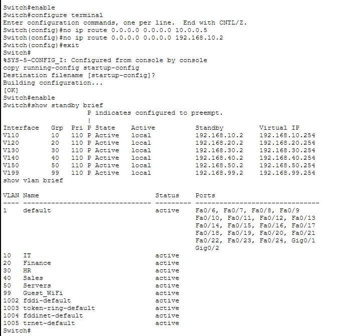

# Enterprise Network Infrastructure

A 3-tier enterprise network built and simulated in Cisco Packet Tracer, 
demonstrating VLAN segmentation, inter-VLAN routing, gateway redundancy, 
and traffic security policies.

## Overview

This project simulates a realistic enterprise LAN with department-based 
network segmentation, high-availability routing, and access control — 
designed to reflect the kind of infrastructure decisions made in real 
corporate networks.

## Topology

- **Core layer:** 2 routers (Cisco 2911) providing inter-site routing
- **Distribution layer:** 3 multilayer switches (Cisco 3560) handling 
  inter-VLAN routing and redundancy
- **Access layer:** 4 switches (Cisco 2960) connecting end-user devices

## VLAN Design

| VLAN | Name       | Subnet             |
|------|------------|---------------------|
| 10   | IT         | 192.168.10.0/24     |
| 20   | Finance    | 192.168.20.0/24     |
| 30   | HR         | 192.168.30.0/24     |
| 40   | Sales      | 192.168.40.0/24     |
| 50   | Servers    | 192.168.50.0/24     |
| 99   | Guest_WiFi | 192.168.99.0/24     |

Each VLAN is isolated at Layer 2 and routed between via SVIs (switched 
virtual interfaces) on the distribution layer.

## Redundancy — HSRP

All 6 VLANs run HSRP (Hot Standby Router Protocol) across two distribution 
switches, providing automatic gateway failover:

- **Multilayer Switch1** — Active (priority 110)
- **Multilayer Switch0** — Standby (priority 100)

Each VLAN shares a virtual gateway IP (e.g., 192.168.10.254) so that if 
the active switch fails, the standby takes over transparently with no 
manual reconfiguration on end devices.

## Security — Access Control Lists

Two ACLs enforce traffic segmentation between departments:

1. **GUEST_RESTRICT** — blocks Guest WiFi (VLAN 99) from reaching IT, 
   Finance, HR, and Servers, while still permitting general traffic
2. **SALES_RESTRICT** — blocks Sales (VLAN 40) from directly reaching 
   the Servers VLAN (50), reflecting realistic access boundaries

## Verification

Inter-VLAN routing was tested and confirmed working end-to-end, with 
0% packet loss between hosts in different VLANs:

## Skills Demonstrated

- VLAN design and trunking (802.1Q)
- Inter-VLAN routing via SVIs on multilayer switches
- First-hop redundancy protocols (HSRP)
- Access control list design for network segmentation
- Systematic network troubleshooting (diagnosed and resolved multiple 
  trunk misconfigurations during build/test)

## Tools

- Cisco Packet Tracer 9.0.1
